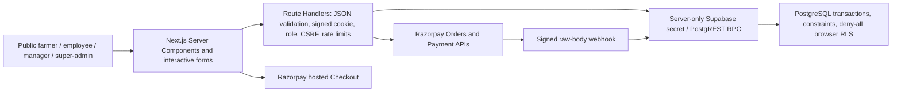

# Application and trust-boundary map — 15 September 2026

Inspection completed before application changes for this audit. Earlier uncommitted payment, form and Trash work is part of the baseline. Hosted checks are read-only.

## Actual scope

Custom mobile/password accounts with bcrypt and revocable 12-hour database sessions; no Supabase Auth integration. Roles: farmer_referrer, employee, manager, super_admin. No separate admin role, KSK, approval workflow, uploads, buckets, SMS or settlement module. Cash is an acknowledgment: employee keeps cash and personally pays online. Referral payouts are offline disbursement records.

Trust boundaries: untrusted browser form/URLs/cookies; signed session versus database account/role state; checkout bearer capability versus registration; Next.js service credential versus browser-denied database; provider response versus validated order/amount/currency; raw webhook versus signature verification; free-text versus escaped React/CSV; secret environment versus client bundle; local migrations versus hosted migration ledger; receipt UUID link versus bearer access; local synthetic provider tests versus real gateway acceptance.

Post-inspection additions: `/r/[code]` validates a referral code and redirects only to the local registration route. `/dashboard/admin/payments/[id]` exposes retained financial history only to manager/super_admin after profile erasure. `get_registration_fee()` is service-only; the server passes its integer amount to the registration UI. No new table, browser database grant or external integration was introduced.

## Pages and handlers

| Source | Method / screen |
|---|---|
| `src/app/dashboard/admin/account/page.tsx` | page |
| `src/app/dashboard/admin/error.tsx` | error |
| `src/app/dashboard/admin/layout.tsx` | layout |
| `src/app/dashboard/admin/loading.tsx` | loading |
| `src/app/dashboard/admin/new/[kind]/page.tsx` | page |
| `src/app/dashboard/admin/page.tsx` | page |
| `src/app/dashboard/admin/registrations/[id]/page.tsx` | page |
| `src/app/dashboard/farmers/[id]/page.tsx` | page |
| `src/app/dashboard/loading.tsx` | loading |
| `src/app/dashboard/page.tsx` | page |
| `src/app/error.tsx` | error |
| `src/app/layout.tsx` | layout |
| `src/app/login/page.tsx` | page |
| `src/app/not-found.tsx` | not-found |
| `src/app/page.tsx` | page |
| `src/app/receipt/[token]/page.tsx` | page |
| `src/app/register/page.tsx` | page |
| `src/app/api/admin/aadhaar/route.ts` | POST |
| `src/app/api/admin/bulk/route.ts` | POST |
| `src/app/api/admin/grants/route.ts` | POST, PATCH |
| `src/app/api/admin/lookup/route.ts` | GET |
| `src/app/api/admin/payouts/route.ts` | POST |
| `src/app/api/admin/reconcile/route.ts` | POST |
| `src/app/api/admin/staff/route.ts` | POST, PATCH |
| `src/app/api/auth/login/route.ts` | POST |
| `src/app/api/auth/logout/route.ts` | POST |
| `src/app/api/auth/password/route.ts` | POST |
| `src/app/api/farmers/[id]/route.ts` | PATCH |
| `src/app/api/payments/orders/route.ts` | POST |
| `src/app/api/payments/status/route.ts` | GET, POST, DELETE |
| `src/app/api/payments/verify/route.ts` | POST |
| `src/app/api/payments/webhook/route.ts` | POST |
| `src/app/api/receipts/[token]/route.ts` | GET |
| `src/app/api/registrations/route.ts` | POST |

## Database / RLS matrix

Hosted inspection: 28 tables, all RLS enabled; no policies for SELECT/INSERT/UPDATE/DELETE; browser roles have no table access. No publicly executable security-definer RPCs. Service-role RPCs run as owner with empty search_path. RLS does not constrain the owner/service boundary. Supabase Auth users=0, buckets=0, Edge Functions=0.

For every row below: SELECT/INSERT/UPDATE/DELETE policies = none; anonymous/authenticated access = denied; intended access = authorized server RPC only. Risk concerns the service/owner boundary, not a discovered browser bypass.

| Table | RLS | Intended use | Risk / baseline protection |
|---|---|---|---|
| `public.accounts` | Yes | Login identity (sensitive) | Restricted server boundary; sensitive roles/scope required |
| `public.account_roles` | Yes | Role assignment | Restricted server boundary; sensitive roles/scope required |
| `public.persons` | Yes | Farmer personal profile (sensitive) | Restricted server boundary; sensitive roles/scope required |
| `private.person_identifiers` | Yes | Encrypted Aadhaar/fingerprint (sensitive) | Restricted server boundary; sensitive roles/scope required |
| `public.districts` | Yes | Geography catalog | Restricted server boundary; sensitive roles/scope required |
| `public.talukas` | Yes | Geography catalog | Restricted server boundary; sensitive roles/scope required |
| `public.referrer_profiles` | Yes | Referral codes | Restricted server boundary; sensitive roles/scope required |
| `public.fee_versions` | Yes | Future fee configuration | Restricted server boundary; sensitive roles/scope required |
| `public.commission_rate_versions` | Yes | Future commission configuration | Restricted server boundary; sensitive roles/scope required |
| `public.registrations` | Yes | Fee/referral/registration snapshot | Restricted server boundary; sensitive roles/scope required |
| `public.registration_plots` | Yes | Submitted plots | Restricted server boundary; sensitive roles/scope required |
| `public.cash_collections` | Yes | Employee cash acknowledgment | MEDIUM: mutable financial evidence at service boundary |
| `public.payment_orders` | Yes | Provider order binding | MEDIUM: mutable financial evidence at service boundary |
| `public.payment_attempts` | Yes | Captured payment history | Immutable trigger + revoked write privileges |
| `public.payment_events` | Yes | Webhook evidence and processing state | MEDIUM: mutable financial evidence at service boundary |
| `public.farmers` | Yes | Paid farmer link | Restricted server boundary; sensitive roles/scope required |
| `public.farmer_plots` | Yes | Paid farmer plot copy | Restricted server boundary; sensitive roles/scope required |
| `public.memberships` | Yes | Membership entitlement | Restricted server boundary; sensitive roles/scope required |
| `public.referral_earnings` | Yes | Commission ledger | Immutable trigger + revoked write privileges |
| `public.referral_payouts` | Yes | Offline disbursements | Immutable trigger + revoked write privileges |
| `public.payout_allocations` | Yes | Legacy allocation table, current recorder uses totals | MEDIUM: mutable financial evidence at service boundary |
| `public.receipts` | Yes | Issued immutable receipt | Immutable trigger + revoked write privileges |
| `public.temporary_permission_grants` | Yes | Scoped expiring edits | Restricted server boundary; sensitive roles/scope required |
| `public.audit_events` | Yes | Audit trail | Immutable trigger + revoked write privileges |
| `private.checkout_orders` | Yes | Order creation reservation | Restricted server boundary; sensitive roles/scope required |
| `private.account_sessions` | Yes | Revocable session IDs | Restricted server boundary; sensitive roles/scope required |
| `private.rate_limits` | Yes | Hashed throttle buckets | Restricted server boundary; sensitive roles/scope required |
| `private.registration_archives` | Yes | Recoverable Trash | Restricted server boundary; sensitive roles/scope required |

## Migration / infrastructure drift

Hosted has 16 migrations including remote-only `live_trial_fee`; local baseline has 16 including unapplied `admin_permanent_delete`. Hosted latest fee is **100 paise (₹1)**; original 50,000-paise fee remains. Do not replay migrations by timestamp or silently reset pricing. No storage policies or upload handling apply to the current product. Secrets are server-only environment variables; only application URL is NEXT_PUBLIC. Scan of 508 reachable git blobs found no token/private-key signature hits and only `.env.example` tracked; this is heuristic evidence, not a guarantee that every secret format is covered.
