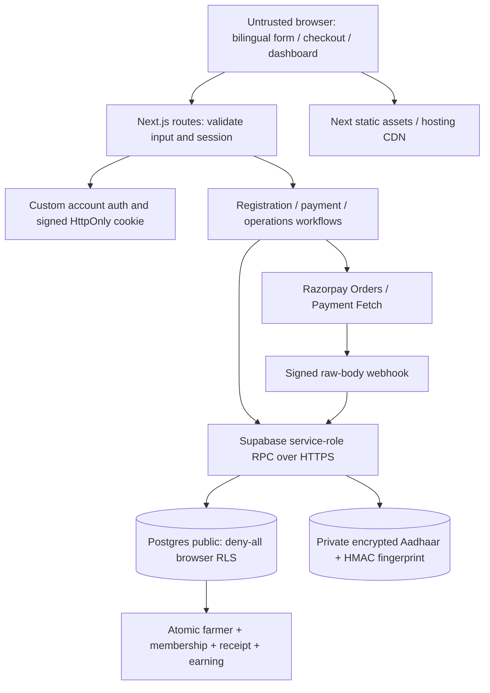

# Production audit discovery — 2026-09-14

Inspected all application routes, server helpers, components, four migrations, seeds, package manifest/lockfile and project documentation before changing implementation. Existing local changes were present and are preserved.

## Architecture and inventory

Next.js 16.3.3 App Router, React 19.2.8, TypeScript 5.9.3, Zod 4.6.4; Node runtime; JSON Route Handlers; custom mobile/password authentication (Postgres pgcrypto bcrypt cost 12), HMAC-signed 12-hour cookies, live database role lookup. Supabase Postgres is reached through a server-only fetch wrapper using service-role RPCs; no ORM or browser database client. Razorpay Orders, Payment Fetch and captured-payment webhooks. Static assets and self-hosted Poppins/Noto fonts are served by Next.js. Vercel configuration exists locally. No email/SMS, object uploads, background worker, distributed cache, analytics, monitoring SDK or repository CI was found.

Trust boundaries: browser to Next.js; signed cookie to current active account/roles; Next.js privileged API key to PostgREST; database security-definer functions; Razorpay signature and provider response. Aadhaar and password enter only the registration request; Aadhaar becomes AES-256-GCM ciphertext and keyed fingerprint, password becomes bcrypt. Receipts contain masked mobile and no Aadhaar. Receipt UUID URLs are bearer links.

Database: accounts/roles, persons/private identifiers, district/taluka lookup, immutable fee/commission snapshots, registrations/plots/cash collection, gateway orders/attempts/events, farmers/plots/memberships, earnings/payouts/allocations, receipts, scoped grants and audit events. Monetary values are integer paise and basis points. Finalization uses locks and a transaction, with unique entitlements per registration. Existing payout balance calculation uses an advisory lock.

## Initial highest-risk findings

1. CRITICAL: migration 0003 creates six security-definer admin RPCs without revoking PUBLIC execute. Live privilege query and Supabase advisor confirm anon/authenticated execution. A known privileged actor UUID can bypass Next.js authorization.
2. HIGH: gateway order creation precedes DB recording on every request, using a fresh idempotency key. Concurrent/retried requests create independent payable orders.
3. HIGH: order endpoint accepts any registration UUID without checkout ownership; pricing is hardcoded/client submitted instead of sourced before provider creation.
4. HIGH: finalization returns early for completed registrations, dropping evidence of additional captured payments; payment identity is not explicitly bound to the fetched provider order.
5. HIGH: registration and payment state are component-only; reload/lost responses can strand pending unique mobile/Aadhaar records.
6. HIGH: failed webhook event updates roll back on rethrow; no durable failed-event recovery/reconciliation implementation despite documentation claiming it.
7. HIGH: offline payout POST has no durable idempotency key and converts decimal money via floating-point multiplication.
8. HIGH: process-local login throttle resets across instances; no per-session revocation/password recovery/MFA lifecycle.
9. HIGH: default privileges remain unsafe for future RPCs; edit grants bypass the employee onboarding-only visibility invariant.
10. HIGH: only two arithmetic tests, no CI, no restore drill evidence, gateway acceptance, load evidence or active alerting.

## Implementation sequence

1. Privilege-only additive migration and live privilege verification; preserve service-role access.
2. Local isolated Postgres regression environment; checkout ownership, serialized order creation, capture binding, durable webhook failures, retry-safe payouts and scoped edits.
3. Request size/origin checks, safe errors, dependency timeouts, persistent abuse limits and session revocation; recoverable UI async states.
4. Full lint/type/test/build checks, SQL regression, local performance/browser checks, CI and operational runbook.
5. Final evidence-based report separating implemented fixes from unverified provider, infrastructure and business acceptance gates. No production payment or customer-data mutations in testing.
