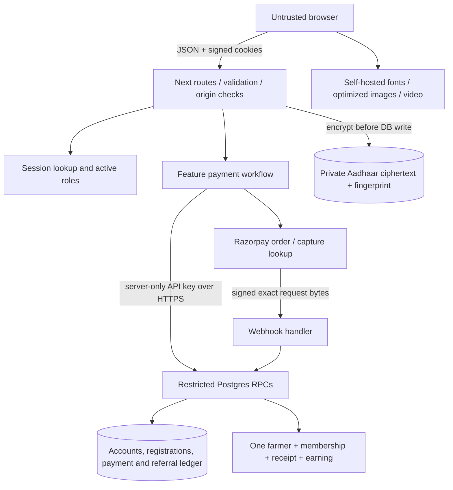

> **MVP scope update (2026-09-14):** This audit is historical baseline evidence. The follow-up scope excludes MFA, self-service recovery and in-app refund/correction workflows as launch requirements. Current implementation, measurements, deployment state and acceptance gaps are in [MVP_OPTIMIZATION_RESULTS.md](MVP_OPTIMIZATION_RESULTS.md).

# A. Executive Summary

**Decision: do not enable real customer payments yet.** The application has a sound small-monolith foundation, and this audit fixed concrete authorization, checkout, concurrency and accounting defects. Remaining launch gates include deployment of the coordinated application/database changes, real Razorpay acceptance, payment-exception accounting, account recovery/MFA, monitoring and a demonstrated backup restore.

This report covers the repository and the connected Supabase project's observable controls on 14 September 2026. It distinguishes source inspection, isolated execution and live read-only evidence. It is not a claim that the new application revision is deployed or that production load/browser compatibility has been proven.

Scores are **provisional engineering assessments**, based on the implementation and tests inspected, rather than measured reliability percentages. Controls, tests, failure recovery and operational evidence each contribute up to 25 points; absent deployment evidence prevents a launch-ready rating. Performance is scored for the inspected assets/rendering and local measurements, with low confidence for real users.

| Area | Score /100 | Basis and remaining limitation |
|---|---:|---|
| Production readiness | 64 | Major defects remediated locally; multiple external launch gates remain |
| Security | 75 | Live RPC exposure closed, server input/session controls tested; MFA/recovery/privacy operations incomplete |
| Performance | 65 | Small compressed bundles and fast local reads; no mobile Web Vitals or production percentiles |
| Database | 80 | Transactions, uniqueness, indexed FKs and real race tests; exceptions/pagination/retention remain |
| Payment safety | 70 | Capture binding, order reservation and deduplication tested; real gateway and operator recovery pending |
| Frontend/UX | 78 | Brand/bilingual form preserved; network recovery and motion control improved; limited browser matrix |
| Backend architecture | 80 | Server-only infrastructure and feature payment workflow; some legacy SQL/UI concentration remains |
| Reliability | 65 | Durable failed events, bounded fetches and recovery; no scheduled reconciliation or verified alerts |
| Testing | 75 | Unit/security, SQL, concurrent DB and isolated HTTP tests; no real gateway/browser E2E pipeline |
| DevOps/observability | 45 | CI/runbook/logging added; hosted CI, deployment gates, alert delivery and restore drill unverified |

**Changes already applied to connected Supabase:** `restrict_privileged_rpcs` and `default_function_privileges`. A follow-up query found **zero** privileged public RPCs executable by anon/authenticated, with the application's existing 14 server functions still callable by service_role. No active account matched the known development-seed password. The project had zero payment attempts at inspection. No payment was charged, refunded or disbursed in this audit.

**Prepared and locally tested, not deployed remotely:** `payment_reliability`, `auth_and_operations_hardening`, application changes and CI. Read [the runbook](PRODUCTION_RUNBOOK.md) before the coordinated release; old and new order/payout callers are not interchangeable.

# B. Architecture Overview

The initial discovery and top-ten findings were produced before code changes in [AUDIT_DISCOVERY.md](AUDIT_DISCOVERY.md).

| Layer | Implementation |
|---|---|
| Frontend/backend | Next.js 16.3.3 App Router; React 19.2.8; Node runtime; TypeScript 5.9.3 |
| Reads/interactions | Server Components for dashboard/receipt reads; Client Components for forms, checkout and marketing interactions |
| API | JSON Route Handlers; Zod 4.6.4; async route params/searchParams/cookies conventions checked against installed Next docs |
| Database/data access | Supabase Postgres; server-side fetch to PostgREST RPCs; no ORM |
| Authentication | Mobile/password, pgcrypto bcrypt cost 12; signed HttpOnly cookie; new revocable database sessions |
| Authorization | Active-account/role checks; signed actor identity; server-only security-definer RPCs; onboarding ownership and scoped field grants |
| Payments | Razorpay Orders, Payment Fetch, order-payments lookup and signed webhooks |
| Storage/media | Repository public assets, Next image optimization and self-hosted Poppins/Noto Sans Devanagari; no upload/object-storage workflow |
| Hosting | Local Vercel configuration and project documentation; actual DNS/TLS/CDN/host settings not audited remotely |
| Cache/jobs | Static public route/assets; no application data cache, distributed worker or scheduled reconciliation |
| Communications/analytics | No email, SMS, OTP, OAuth, analytics SDK, or notification provider configured in code |
| CI/observability | New GitHub workflow; structured application/RPC logs; no verified log drain, error monitor or alert channel |

Sensitive flows: password and Aadhaar are submitted over the application connection; password becomes bcrypt, Aadhaar becomes AES-256-GCM ciphertext and a keyed fingerprint. No Aadhaar is returned by API/dashboard/receipt. New checkout loading clears Aadhaar/password inputs before loading third-party JavaScript. Receipt UUIDs are bearer capabilities and now have noindex/no-referrer/no-store controls. Only a pending payout request UUID is placed in sessionStorage; auth and checkout cookies are HttpOnly.

# C. Critical Problems

**C1 — CRITICAL: anonymous administrative RPC execution (fixed live).** Migration `0003_operations_console.sql` created six security-definer functions without revoking PostgreSQL's default PUBLIC execute. A caller who obtained a privileged actor UUID could directly invoke staff creation, payout recording, grants or protected reads/edits through PostgREST without a signed application session. RLS did not protect these function calls. Supabase's advisor and explicit privilege queries independently confirmed it. The fix revokes public/anon/authenticated execution, preserves service-role calls, removes the global default execute grant, and tests every privileged public function's exposure.

The initial schema-specific default revoke was insufficient: PostgreSQL global default privileges are additive. A newly created function test caught this and a second small live migration removed the global default. New migrations also explicitly revoke execution before commit. [PostgreSQL privileges](https://www.postgresql.org/docs/current/sql-grant.html) and the [Supabase advisor remediation](https://supabase.com/docs/guides/database/database-linter?lint=0028_anon_security_definer_function_executable) explain this boundary.

No evidence of exploitation was established. Inspect retained provider/access/audit logs for unexpected administrative activity; absence of a default password or existing payments does not prove absence of past access.

# D. High-Priority Problems

| ID | Defect / attack or failure path | Business impact | Fix and verification |
|---|---|---|---|
| H1 | Retry or simultaneous order requests created new provider orders with random idempotency IDs | Multiple independently payable orders | Durable per-registration reservation; reuse a bound order; ambiguous requests remain blocked. Twelve simultaneous reservations yield one creator |
| H2 | Caller supplied registration ID/reference/price without checkout ownership | Unauthorized payment initiation, wrong snapshot and resource abuse | Signed HttpOnly checkout capability; ID comparison; database price/reference before provider creation; HTTP unauthorized test |
| H3 | Completed-registration early return discarded later captures | Unrecorded extra collection | Persist capture first, bind payment ID/order/amount, flag extra capture for review; SQL and HTTP duplicate tests |
| H4 | Webhook error was recorded then rethrown, rolling back the record | Invisible failures and no recovery evidence | Persist failure with safe SQLSTATE, return retryable 503; retry failed event transactionally; early-event SQL test |
| H5 | Browser-only saved state and unhandled network errors | Stranded paid/pending users and repeat payments | Seven-day checkout capability, status/reconciliation, matching-credential registration retry, bounded request states; HTTP reload test |
| H6 | Payout retries had no stable ID; decimal amount used floating-point multiplication | Duplicate deductions and rounding surprises | Exact decimal-to-paise parser; unique request key and balance lock; SQL replay/change/overbalance tests |
| H7 | Process-local IP/mobile throttles reset on scale-out; logout only deleted cookie | Credential attacks and replay of stolen sessions | Database limits, separate account/IP limits, revocable session rows, atomic login/session creation and password-change revocation; SQL and logout replay tests |
| H8 | Temporary grant allowed viewing unrelated employee farmers | Broken onboarding-only visibility rule | Ownership required for grant/read/edit, active role checks, scoped/expired/revoked permission tests |
| H9 | Browser/webhook race deadlocked through FK locks on payment_orders | Intermittent capture verification failures | Registration lock followed by order NO KEY UPDATE, compatible with FK KEY SHARE; real 12-way race passed |
| H10 | API errors returned raw database messages; unlimited bodies and fetch waits | PII/internal disclosure and resource exhaustion | Safe error mapping, correlation IDs, streamed byte caps, strict content type/origin, provider/DB deadlines; boundary tests |

Remaining high-priority launch work:

- Real Razorpay credentials/webhook/capture/settlement acceptance and provider-outage/app-switch tests.
- A staffed and exercised path for ambiguous order creation, additional capture, refunds and disputes. Notifications are preserved, but linked financial correction/commission reversal accounting is not implemented.
- Scheduled provider reconciliation with bounded retries/alerting; current recovery is webhook retry plus explicit checkout-status reconciliation and operator instructions.
- MFA or step-up for operations, verified lost-password recovery, breached-password screening and privileged session management. Password change with all-session revocation now exists.
- Backup/PITR configuration, key recovery and an actual restore drill; edge abuse limits and trusted IP-header configuration.
- Approve retention, identity collection purpose and customer-data export/correction/deletion processes; no automatic deletion policy was invented.

# E. Medium/Low Improvements

The operations console aggregates all employees/referrers and only the latest 100 farmers. Add independently paginated/searchable selectors and reports before large datasets; simply truncating all lists would remove staff functionality. Dashboard recent lists are bounded, but totals still scan each account's ledger. `payout_allocations` is unused by the current aggregate-balance model; decide whether per-earning allocation is needed when corrective accounting is specified.

Long, dense JSX remains in registration/admin/marketing components. Payment orchestration now lives in a feature server module; wholesale UI rewrites would add risk without fixing a measured defect. Some DTOs are duplicated. There were no runtime `any`, eval, dynamic HTML injection, upload, shell-execution, or user-selected fetch URL paths identified in application code. The test RPC bridge is isolated test infrastructure and is never imported into the app.

CSP still allows inline scripts because the existing static Next hydration strategy uses them. Move to nonce-based CSP with an explicit rendering/performance plan; do not remove unsafe-inline blindly and break hydration/checkout. Hero video now respects reduced motion and has a pause button; tabs have linked ARIA semantics; counters have useful server-rendered content; no-JS marketing reveals remain visible. Add comprehensive contrast, focus-trap, screen-reader and browser testing.

Public copy/consent and the receipt's no-refund statement need business/legal approval, especially for duplicate collection and provider reversals. This audit does not establish legal compliance.

# F. Performance Analysis

[AUDIT_METRICS.json](AUDIT_METRICS.json) contains local warm HTTP samples and gzip estimates. These are full-response localhost timings, not production TTFB or Core Web Vitals. Each route used 100 requests at concurrency 10. The unauthenticated status route did not exercise database work. No real payment provider was load tested.

Final-build measured sample: home p50/p95/p99 24/58/59 ms (333 requests/sec), registration 62/132/133 ms (128 requests/sec), unauthenticated status 21/39/44 ms (260 requests/sec); zero errors in 300 requests. Home references total 184,963 bytes gzipped JS and 8,196 bytes gzipped CSS. Static hero video is 3.89 MB; logo source is 1.22 MB, served through Next image optimization in page content.

Main bottlenecks: bcrypt work on login/registration, serial network round trips to Supabase and Razorpay, unbounded console aggregates, ledger totals, and video delivery on slow mobile links. No application N+1 HTTP loop was found; the console has correlated per-row aggregate subqueries, which can become an effective N+1 query-plan problem. Existing FK indexes should be retained until realistic query plans and workload data justify changes. The live advisor's unused-index notices occurred on a near-empty project and are not evidence to drop them.

Provisional production budgets pending expected traffic:

| Metric | Target |
|---|---|
| Public initial JS/CSS gzip | <= 220 KB / <= 30 KB |
| Mobile p75 LCP / INP / CLS | <= 2.5s / <= 200ms / <= 0.1 |
| Public p95 TTFB | <= 800ms from target Indian regions |
| Internal read p95 / p99 | <= 1s / <= 2s |
| Checkout/verification p95 excluding user interaction | <= 3s, with provider latency measured separately |
| Provider fetch / database RPC deadline | 8s / 10s |
| Client request deadline | 25s, then explicit uncertain-result recovery |
| Error rate under agreed peak load | < 1%, with expected 4xx tracked separately |

FCP, LCP, INP, CLS, blocking time, actual mobile transfer, production p95/p99, CPU/RAM, DB utilization and failure breaking points remain unmeasured. Browser automation exposed DOM but not performance timing APIs in this session. Run a staging k6/Lighthouse/WebPageTest campaign and real-user monitoring before claiming these budgets pass. No speculative cache/queue/library was added to improve an unmeasured number.

# G. Database Review

| Tables | Review |
|---|---|
| accounts/account_roles | Unique mobile, restricted roles, bcrypt; active status checked by authorization; new revocable sessions |
| persons/private identifiers | Unique person/account/mobile/fingerprint; encrypted identifier; private schema/RLS; geography composite FK added NOT VALID |
| districts/talukas | Lookup PKs and district relationship; indexed; redundant candidate taluka district index is low priority |
| fee/commission versions | Integer paise/basis points, snapshotted registration values; overlapping effective periods remain possible and need an administrative versioning policy |
| registrations/plots/cash | Transactional creation, one person/registration; cash retained by employee; no later settlement; unpaid identity retention still needs a policy |
| orders/attempts/events | Provider-ID uniqueness, reservations, bound captures, durable failed events, FK-lock race tested; failed/refund/dispute events do not downgrade completed membership |
| farmers/plots/memberships | Unique registration/person entitlement; activated only after verified capture; original plots copied transactionally |
| earnings/payouts/allocations | One earning per registration; integer math; payout lock and request uniqueness; immutable records; allocation and corrective accounting incomplete |
| receipts | One receipt per registration/payment/membership; masked mobile; immutable snapshot and bearer token |
| grants/audits | Active role/ownership/field/expiry enforcement; append-only audit trigger; field names logged rather than Aadhaar/before-after PII |
| private sessions/rate limits/checkout reservations | Deny browser access, indexed expiry/lookups, bounded cleanup; no distributed cache dependency |

SQL tests run against real local PostgreSQL 16, including all ordered migrations on a second fresh database. Financial writes remain transactional. No destructive customer-data migration was performed. Immutability is strengthened for captures, earnings, payouts, receipts and audits; database owners still retain administrative power. Cash correction, version overlap, comprehensive retention, exhaustive direct-service-role least privilege and immutable corrective records remain review items. Cloud encryption, SSL enforcement, network restrictions, connection limits and PITR were not established by repository inspection.

# H. Payment Review

1. Validate the bilingual form; derive employee attribution from the signed session; encrypt Aadhaar; create or credential-match a pending registration.
2. Set the registration-scoped checkout capability. Keep fee/commission and referral attribution locked to the database snapshot.
3. Reserve order creation atomically; return existing order for retries. Use server amount/reference and provider key. Missing configuration fails before reserving an external request.
4. Show the hosted gateway only after submission, with one in-flight checkout per form. Saved state survives refresh via cookie/status lookup.
5. Verify browser signature, fetch payment, and compare payment ID, stored order ID, captured status, INR and amount. Signed webhook validates exact raw bytes and the captured entity.
6. Finalize transactionally into one farmer/membership/receipt/earning. Employee cash payer kind is derived from stored payment mode, not the browser.
7. Preserve extra captures and payment-exception notifications for review. Never silently create extra entitlements or overwrite financial history.

Effective state machine: registration `payment_pending -> processing -> completed` inside finalization; pending gateway attempts may remain pending after cancel/failure; order `created -> paid` after verified capture; event `received -> processed/ignored/failed`, with `failed -> processed` on successful retry. Completed registration cannot be downgraded by a late failure. `payment_exception`, expired/failed order states, and reversed/disputed attempt labels existed in the schema but do not form complete product workflows; they must not be represented as implemented refund support.

Farmer referral wins over assisted employee commission; the employee retains onboarding count. Exactly one earning recipient is stored. No claim-request flow, automatic customer refunds or company cash settlement was introduced. [Razorpay's webhook guidance](https://razorpay.com/docs/webhooks/) recommends provider fetch when immediate status is needed; [event IDs](https://razorpay.com/docs/webhooks/faqs/?preferred-country=IN) support duplicate detection.

| Scenario | Evidence |
|---|---|
| Successful capture / duplicate callback / duplicate webhook | SQL + isolated HTTP passed |
| Webhook before order binding / after browser / order.paid duplicate | SQL passed |
| Invalid signature / incorrect amount / NULL verification flag | Unit, SQL and HTTP passed |
| Concurrent orders and finalization | 12-way real Postgres races passed |
| Additional capture | Preserved and flagged; SQL passed |
| Failed event retry / out-of-order failure | Durable recovery and no downgrade; SQL passed |
| Refresh and closed-browser recovery | HTTP cookie/status recovery passed; full mobile app-switch flow pending |
| Provider/DB/network outage | Deadlines and safe uncertainty implemented; limited failure tests, real outage drill pending |
| User cancel / pending / expired payment | UI messages present; actual gateway interaction pending |
| Refund / partial refund / duplicate refund / dispute | No refund initiation endpoint; notifications preserved, correction policy and lifecycle tests pending |

# I. Security Review

Server-only secrets are preserved, including the pre-existing change to Supabase's newer `apikey` header usage. The server never uses client role/actor input. Cookie signatures enforce purpose, UUID format, expiry and minimum secret size; sessions additionally require an active unrevoked DB row. Passwords longer than bcrypt's 72-byte limit are rejected; new registrations/staff/password changes require 15 characters at the authoritative creation/change boundary, while matching legacy registration retries remain possible. Unknown/disabled-account authentication performs bcrypt work to reduce timing enumeration. [Supabase's current key migration guidance](https://supabase.com/docs/guides/getting-started/migrating-to-new-api-keys) supports server-only secret keys on the apikey header.

Origin checks cover unsafe API methods; signed webhooks are the explicit exception. API JSON is bounded at 32 KiB, webhook bodies at 256 KiB. Input validation covers IDs, dates, geography, enum values, field grants and payout decimal syntax. HSTS, frame denial, nosniff, permissions/referrer policies and receipt indexing/cache controls are present. CORS is not broadened. App errors do not return SQL, internal paths, Aadhaar or stack traces. No application upload, arbitrary URL fetch, shell execution, raw HTML injection or dynamic SQL surface was found.

`npm audit` reported zero vulnerabilities for the installed dependency graph (405 total counted entries). A bounded scan of 93 tracked files found no matches for the checked secret-key/private-key patterns; `.env.local` is ignored. This is not a complete historical secret scan, malware audit or penetration test. Exposed default test credentials in the development seed are explicitly test-only; the connected project's active-password check found zero matches.

# J. UX State Matrix

| Screen | Loading | Empty | Success | Error/offline | Pending/cancelled | Unauthorized/forbidden |
|---|---|---|---|---|---|---|
| Home | Poster/optimized assets | N/A | Content/tabs/reveals | Static content and no-JS reveal fallback | Video pause/reduced motion | Public |
| Registration | Restore/save/checkout labels, disabled submission | Full bilingual form | Saved reference and verified receipt link | Bounded request error; sensitive inputs cleared on save | Restore/check status; checkout-dismiss message; uncertain order cannot create replacement | Scoped checkout rejects mismatched/missing capability |
| Login | Disabled loading button | Credential form | Dashboard navigation | Network errors release busy state; generic credentials message | N/A | 401; account/IP limits |
| Dashboard | Loading route boundary | Earnings/payout/onboarding empty text | Current authorized read | Error boundary; clipboard/logout feedback | N/A | Session redirect; current roles checked |
| Staff creation | Shared busy guard | Role/form defaults | Reset captured form element and refresh | catch/finally; retry conflict safe | No duplicate mobile account | Super-admin only |
| Offline payout | Shared busy guard | Referrer selector can be empty | Same request returns same payout | Request UUID survives uncertainty/reload | Must reconcile before replacing unresolved request | Manager/super-admin only |
| Temporary access | Shared busy guard | Selectors | Grant saved | Field/ownership/expiry validation | Max seven days | Manager/super-admin; own-onboarded farmer only |
| Farmer profile | Disabled save | Read-only mode | Saved status | catch/finally and schema checks | Expired/revoked grant rejected | Ownership/role/field checks |
| Password change | Saving label | Form | All sessions revoked, login redirect | Safe current-password/validation error | N/A | Signed active session |
| Receipt | Server read | Invalid token -> 404 | Masked immutable receipt/print | Server error boundary | Only exists after verified capture | Unguessable bearer link; noindex/no-referrer |

Browser inspection covered desktop and 390px mobile public/registration layouts and add-plot interaction; no mobile horizontal overflow was found in the inspected form. Third-party checkout script was absent before registration submission. Final-build video pause and ArrowRight crop-tab selection worked, with no captured browser errors. Full Safari/Firefox/Edge, tablet/landscape, screen-reader, contrast and payment-popup acceptance are not claimed.

# K. Recommended Architecture

Keep the Next.js monolith and Postgres transactional RPC model. Continue routing business workflows through feature server modules and keep server-only infrastructure narrow. Add explicit paginated operations reads, a minimal bounded reconciliation job, immutable financial adjustment records and a verified identity recovery/MFA system. Use hosting-native logs/alerts and Postgres for the present durable coordination needs. Introduce a queue or cache only after measured throughput or isolation requirements justify it; do not cache private financial/session responses across accounts.

# L. Implementation Roadmap and Readiness Checklist

**P0 — before real payments:** deploy the tested coordinated changes; reconcile migration history; confirm trusted origin/IP configuration; pass real Razorpay matrix; establish exception accounting and recovery ownership; configure tested alerts and restore drill; implement privileged MFA and verified recovery; approve privacy/retention and public payment policy.

**P1 — before significant traffic:** paginated/searchable console and ledger reports; scheduled provider reconciliation; production load/latency/connection campaign; CSP nonce plan; verified deployment rollback; operational session management and failed-auth monitoring.

**P2:** full accessibility/browser automation, approved data export/correction/retention implementation, detailed operational audit review UI, independent sensitive-key rotation, canonical/OG/content refinements and video delivery optimization.

**P3:** cache/queue partitioning, analytics and advanced reports only when supported by a real requirement and measurement.

| Area | Classification after local remediation | Why |
|---|---|---|
| Architecture | PASS | Appropriate monolith, no speculative replacement required |
| Frontend | NEEDS IMPROVEMENT | Public/browser subset verified; full compatibility pending |
| Backend | NEEDS IMPROVEMENT | Boundaries improved; central exception monitoring incomplete |
| Database | NEEDS IMPROVEMENT | Core SQL/races pass; corrective accounting and scale reads incomplete |
| Authentication | HIGH RISK | MFA/verified lost-password recovery missing |
| Authorization | PASS | Live RPC exposure closed; new ownership tests pass, rollout pending |
| Security | NEEDS IMPROVEMENT | CSP, edge configuration and historical incident review remain |
| Payments | HIGH RISK | Real provider acceptance and exception lifecycle incomplete |
| Payment UX | NEEDS IMPROVEMENT | Recovery implemented; real gateway/mobile matrix incomplete |
| Performance | NEEDS IMPROVEMENT | Local samples only; no production/Web Vitals evidence |
| Accessibility | NEEDS IMPROVEMENT | Motion/tab improvements; full assistive-tech audit pending |
| Observability | HIGH RISK | Log schema exists; no verified active alert delivery |
| Testing | NEEDS IMPROVEMENT | Meaningful automated checks added; gateway/multi-browser coverage incomplete |
| Deployment | HIGH RISK | Coordinated release and hosted CI not yet executed |
| Backups | HIGH RISK | No restore drill or PITR evidence |
| Privacy | HIGH RISK | Encryption present; approved retention/recovery/key-rotation operations missing |
| Scalability | NEEDS IMPROVEMENT | Durable limits/locks; unbounded console and unknown peak target |

Uploads, OAuth, OTP delivery, subscriptions, inventory, tax/discount engines, customer claims and multi-tenancy are not implemented product surfaces. They were classified as not applicable rather than adding speculative features. Scheduled notifications, analytics/CDN statistics and cloud resource limits could not be assessed without configuration evidence.

# M. Code Changes and Verification

| Batch | Main affected files | Result |
|---|---|---|
| Privilege containment | Two privilege migrations | Applied live; zero exposed privileged RPCs, existing service calls preserved |
| Payment correctness | Payment migration; `features/payments/server`; checkout capability; payment routes | Snapshot pricing, one order reservation, captured identity binding, failed-event durability, additional-capture evidence |
| Auth/operations | Auth migration; session/rate-limit infrastructure; auth/admin/farmer routes | Persistent limits, revocation, password change, payout replay protection, ownership and immutable history |
| Boundary/error handling | `server/http`, database/provider helpers, proxy, schemas | Safe API errors, request IDs, origin/size checks and dependency deadlines |
| UX/accessibility/SEO | Registration/admin/login/profile/actions; HeroVideo; tabs/counters; robots/sitemap/receipt | Recoverable async states, deferred gateway script, preserved bilingual fields/brand, motion control and private indexing controls |
| Regression/CI | Unit tests, SQL regression/concurrency, isolated HTTP services, workflow | Repeatable failure-focused checks with no live customer/payment fixtures |

Validation: lint, typecheck, production build, 11 application tests, fresh-database migration application, SQL regression, 12-way concurrency and the final isolated HTTP suite passed. The HTTP suite ran against the production build and exercised registration retry, ownership, provider signature/capture, duplicate webhooks/callbacks, receipt privacy, session logout replay and status recovery. Hosted GitHub Actions execution and real Razorpay/browser acceptance are separate pending checks. See [PRODUCTION_RUNBOOK.md](PRODUCTION_RUNBOOK.md) for commands, deployment sequencing, recovery and alert requirements.

The corrected revision is substantially safer and reviewable. It is not certified production-ready while the listed P0 gates remain open.
