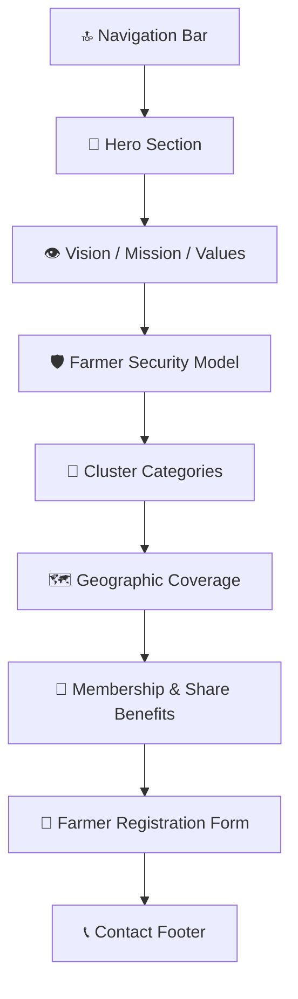

# 🌾 Shri Ganpati Agro Producer Company — Landing Page Design PRD

## Visual Direction Reference


> [!NOTE]
> This is a directional mockup. The final build will be much more polished, with actual content, animations, and responsive behavior.

---

## 1. Project Overview

**Goal:** Design a single-page scrolling landing page for **Shri Ganpati Agro Producer Company** (श्री गणपती ॲग्रो प्रोड्युसर कं. लि.) that communicates the company's mission, farmer-centric model, and membership benefits — primarily in **Marathi** with English support.

**Target Audience:**
- Farmers in Dharashiv district and surrounding talukas
- Krushi Seva Kendras (agricultural service centers)
- Potential cluster coordinators

**Primary Actions:** Contact the company or fill the farmer registration form.

---

## 2. Design Philosophy

### Tone: "Warm, Trustworthy, Alive"

The page should feel like **a welcoming field at golden hour** — not a corporate pitch deck, not a boring government form. The design must:

- Feel **approachable** to a farmer seeing a website for the first time
- Convey **credibility** through clean structure and professional content
- Use **movement & color** to feel alive, not static
- Prioritize **Marathi** text with English labels/subtitles where helpful
- Use **large text, high contrast, simple navigation** for accessibility

---

## 3. Brand System

### 3.1 Color Palette

| Token | Hex | Usage |
|-------|-----|-------|
| `--color-earth-green` | `#1B5E20` | Headers, nav, footer, primary buttons |
| `--color-leaf-green` | `#2E7D32` | Card borders, icons, accents |
| `--color-fresh-green` | `#4CAF50` | Hover states, success indicators |
| `--color-sunrise-gold` | `#F9A825` | Highlights, badges, star ratings |
| `--color-harvest-orange` | `#E65100` | CTAs, important callouts |
| `--color-warm-cream` | `#FFF8E1` | Page background, card backgrounds |
| `--color-soil-brown` | `#5D4037` | Body text, secondary elements |
| `--color-white` | `#FFFFFF` | Card surfaces, form backgrounds |
| `--color-dark` | `#1A1A1A` | Headings on light backgrounds |

### 3.2 Typography

| Element | Font | Weight | Size (desktop / mobile) |
|---------|------|--------|------------------------|
| Marathi headings | **Noto Sans Devanagari** | 700 | 42px / 28px |
| English headings | **Poppins** | 600 | 36px / 24px |
| Body (Marathi) | **Noto Sans Devanagari** | 400 | 18px / 16px |
| Body (English) | **Poppins** | 400 | 16px / 14px |
| Labels/Buttons | **Poppins** | 500 | 14px / 13px |

> [!IMPORTANT]
> **Noto Sans Devanagari** is critical — it renders Marathi beautifully across all devices. We load it from Google Fonts.

### 3.3 Logo Strategy

The logo will be implemented as a **swappable image component** with:
```
<div class="logo-container">
  
</div>
```
- CSS-controlled sizing (not hardcoded dimensions)
- A placeholder/generated logo for initial build
- Easy to swap by replacing `logo.png` — no code changes needed

---

## 4. Page Structure — 9 Sections

The page scrolls vertically through these sections. Each section has a Marathi heading with an English subtitle.



---

### Section 1: Navigation Bar (Sticky)

**Behavior:** Sticks to top on scroll. Transparent on hero, solid green on scroll.

| Element | Content |
|---------|---------|
| Left | Logo + "श्री गणपती ॲग्रो" text |
| Center | Nav links: आमच्याबद्दल · आमचा उद्देश · समूह · नोंदणी · संपर्क |
| Right | 📞 Call button (mobile: phone icon only) |

**Mobile:** Hamburger menu with slide-in drawer.

---

### Section 2: Hero Section 🌅

**Visual:** Full-width sunrise gradient (gold → orange) with CSS-painted agricultural field silhouette at the bottom edge. A subtle animated floating wheat/leaf particles effect.

**Content Layout:**

```
┌──────────────────────────────────────────────────┐
│                                                  │
│          [LOGO - large, centered]                │
│                                                  │
│    श्री गणपती ॲग्रो प्रोड्युसर कंपनी लि.      │
│    Shri Ganpati Agro Producer Co. Ltd.           │
│                                                  │
│    ── "२०१६ पासून बळीराजाच्या सेवेत...." ──      │
│         Serving Farmers Since 2016               │
│                                                  │
│  ┌─────────────────┐  ┌──────────────────┐       │
│  │ 📝 नोंदणी करा   │  │ 📞 संपर्क करा    │       │
│  │  Register Now    │  │  Contact Us      │       │
│  └─────────────────┘  └──────────────────┘       │
│                                                  │
│  ▼ scroll indicator (animated bounce)            │
│▓▓▓▓▓▓▓▓▓▓ field silhouette ▓▓▓▓▓▓▓▓▓▓▓▓▓▓▓▓▓▓  │
└──────────────────────────────────────────────────┘
```

**Animations:**
- Logo fades in on load (0.5s)
- Tagline types in letter-by-letter (1.5s)
- Floating particle seeds/leaves drift slowly in background
- Scroll indicator bounces gently

---

### Section 3: Vision / Mission / Values 👁️

**Background:** Warm cream (`--color-warm-cream`)

**Layout:** Three horizontal cards on desktop, vertical stack on mobile.

```
┌──────────────────────────────────────────────────────────────┐
│                                                              │
│     आमचा उद्देश · Our Purpose                               │
│                                                              │
│  ┌──────────────┐ ┌──────────────┐ ┌──────────────┐         │
│  │ 🚀            │ │ 👁️           │ │ 💎            │         │
│  │  मिशन        │ │   व्हिजन     │ │  मूल्ये       │         │
│  │  Mission      │ │   Vision     │ │  Values       │         │
│  │              │ │              │ │              │         │
│  │ [Marathi     │ │ [Marathi     │ │ 6 values     │         │
│  │  text]       │ │  text]       │ │ as icon+text │         │
│  │              │ │              │ │ pills        │         │
│  │ [English     │ │ [English     │ │              │         │
│  │  subtitle]   │ │  subtitle]   │ │              │         │
│  └──────────────┘ └──────────────┘ └──────────────┘         │
│                                                              │
│  ── Philosophy quote in highlight box ──                     │
│  "शेतकऱ्यांसोबत योग्य व प्रामाणिक हेतूने काम               │
│   करा, यश हमखास मिळेल!"                                     │
│                                                              │
└──────────────────────────────────────────────────────────────┘
```

**Card Style:**
- White card, 12px rounded corners
- Left green border accent (4px)
- Subtle box-shadow
- Icon animates on scroll-into-view (scale bounce)

**Values displayed as 6 small pills/badges:**
🌾 शेतकरी केंद्रित · 🤝 अखंडता · ⭐ उत्कृष्टता · 👥 संघटित कार्य · 📋 उत्तरदायित्व · 💚 प्रामाणिक हेतू

---

### Section 4: Farmer Security Model 🛡️

**Background:** Light green tint with subtle leaf pattern

**Layout:** Central shield/sunflower icon with spokes radiating to 11 benefit cards.

```
┌──────────────────────────────────────────────────┐
│                                                  │
│  शेतकरी सुरक्षितता · Farmer Security             │
│                                                  │
│          ┌───┐                                   │
│    ┌─────│ 🛡️ │─────┐                            │
│    │     └───┘     │                             │
│    ▼               ▼                             │
│  ┌───┐  ┌───┐  ┌───┐  ┌───┐                     │
│  │🌱 │  │🔬 │  │🌍 │  │📊 │                     │
│  │   │  │   │  │   │  │   │                      │
│  └───┘  └───┘  └───┘  └───┘                      │
│    ▼               ▼                              │
│  ┌───┐  ┌───┐  ┌───┐  ┌───┐                      │
│  │👨‍🌾│  │🏭 │  │🤝 │  │🧪 │                     │
│  └───┘  └───┘  └───┘  └───┘                      │
│                                                   │
│  [Each card has Marathi label + English subtitle] │
│                                                   │
└───────────────────────────────────────────────────┘
```

**The 11 items** (from the document):
1. विविध शेती पद्धतीचा अभ्यास — Study of farming methods
2. एकात्मिक शेती पद्धती — Integrated farming
3. निर्यात क्षमता वाढवणे — Export capacity
4. मूल्य साखळी व्यवस्थापन — Value chain management
5. लाभांश भागीदारी — Profit sharing
6. निसर्गावरील अवलंबित्व कमी — Reduce nature dependency
7. सामाजिक भांडवल — Social capital building
8. शेती तज्ञ बांधावर — Experts at doorstep
9. उद्योजकांची मक्तेदारी कमी — Reduce monopoly
10. पर्यायी संवर्धन — Conservation measures
11. समूह शेती प्रयोग — Group farming experiments

**Animation:** Cards reveal one-by-one on scroll (staggered fade-in from center outward).

---

### Section 5: Cluster Categories 🌾

**Background:** White

**Layout:** Interactive tabbed/pill interface showing crop categories.

```
┌──────────────────────────────────────────────────────┐
│                                                      │
│  समूह प्रकार · Cluster Categories                    │
│                                                      │
│  ┌──────┐ ┌────────┐ ┌────────┐ ┌───────┐ ┌──────┐  │
│  │कडधान्ये│ │तृणधान्ये│ │नगदी पिके│ │फळबाग  │ │भाजीपाला│ │
│  │Pulses │ │Cereals │ │Cash    │ │Fruits │ │Vegs  │  │
│  └──┬───┘ └────────┘ └────────┘ └───────┘ └──────┘  │
│     ▼                                                │
│  ┌──────────────────────────────────────────────┐    │
│  │  🫘 सोयाबीन  🫘 तूर  🫘 हरभरा  🫘 मूग       │    │
│  │  🫘 मटकी  🫘 चवळी  🫘 कुळीथ  🫘 मसूर         │    │
│  │  🫘 उडीद  🫘 वाटाणा                          │    │
│  └──────────────────────────────────────────────┘    │
│                                                      │
│  + शेतीपूरक व्यवसाय (Allied Businesses) tab          │
│    पशुपालन, शेळीपालन, कुक्कुटपालन, etc.             │
│                                                      │
└──────────────────────────────────────────────────────┘
```

**Tab categories (6 total):**
1. **कडधान्ये** — Pulses (10 items)
2. **तृणधान्ये** — Cereals (8 items)
3. **नगदी पिके** — Cash Crops (5 items)
4. **फळबाग** — Fruits/Orchards (10 items)
5. **भाजीपाला** — Vegetables (12 items)
6. **शेतीपूरक व्यवसाय** — Allied Businesses (10 items)

**Style:** Active tab is green with white text. Items appear as small rounded chips with emoji icons. Smooth tab-switch animation.

---

### Section 6: Geographic Coverage 🗺️

**Background:** Cream with subtle topographic pattern

**Layout:** Side-by-side map illustration + stats.

```
┌──────────────────────────────────────────────────────────┐
│                                                          │
│  कार्यक्षेत्र · Our Coverage Area                        │
│                                                          │
│  ┌─────────────────────┐  ┌──────────────────────────┐   │
│  │                     │  │                          │   │
│  │   [Dharashiv        │  │  📍 मुख्य कार्यालय       │   │
│  │    District Map     │  │     Dharashiv, MH        │   │
│  │    - SVG with       │  │                          │   │
│  │    talukas colored  │  │  🏘️ ८ तालुके              │   │
│  │    and labeled]     │  │     8 Talukas             │   │
│  │                     │  │                          │   │
│  │   Talukas:          │  │  🏡 ७४१ गावे              │   │
│  │   • Dharashiv       │  │     741 Villages          │   │
│  │   • Tuljapur        │  │                          │   │
│  │   • Umarga          │  │  📏 १०० किमी परिसर        │   │
│  │   • Lohara          │  │     100 km Radius         │   │
│  │   • Kalamb          │  │                          │   │
│  │   • Washi           │  │  🤝 ८ शेजारील तालुके     │   │
│  │   • Bhum            │  │     8 Neighbouring        │   │
│  │   • Paranda         │  │     Talukas               │   │
│  │                     │  │                          │   │
│  └─────────────────────┘  └──────────────────────────┘   │
│                                                          │
└──────────────────────────────────────────────────────────┘
```

**Map approach:** SVG illustration of Dharashiv district with 8 talukas as colored regions. Each taluka lights up on hover/tap. The 100km radius shown as a dotted circle outline.

**Stats:** Large animated counter numbers that count up on scroll-in (e.g., 741 counts from 0 → 741).

---

### Section 7: Membership & Share Benefits 📜

**Background:** Deep green gradient

**Layout:** Benefits listed as large icon cards on a dark background.

```
┌──────────────────────────────────────────────────────────┐
│  ██████████████████ DARK GREEN BG ████████████████████   │
│                                                          │
│  सभासद होण्याचे फायदे · Membership Benefits             │
│  (white text)                                            │
│                                                          │
│  ┌──────────┐  ┌──────────┐  ┌──────────┐               │
│  │  📄       │  │  🏛️      │  │  🌾       │               │
│  │ शेअर      │  │ कंपनी    │  │ समूह      │               │
│  │ प्रमाणपत्र │  │ सभासदत्व │  │ सहभाग    │               │
│  │           │  │          │  │           │               │
│  │ Share     │  │ Company  │  │ Cluster   │               │
│  │ Certificate│ │ Membership│ │ Participation│            │
│  │           │  │          │  │           │               │
│  │ • नॉमिनी  │  │ • मतदान  │  │ • तज्ञ    │               │
│  │   सुविधा  │  │   अधिकार │  │   मार्गदर्शन│             │
│  │ • हस्तांतर│  │ • लाभांश │  │ • बाजार   │               │
│  │   शक्यता  │  │   हक्क   │  │   जोडणी   │               │
│  │ • कायदेशीर│  │ • MOA/AOA│  │ • तंत्रज्ञान│             │
│  │   संरक्षण  │  │   अधिकार │  │   सहाय्य  │              │
│  └──────────┘  └──────────┘  └──────────┘               │
│                                                          │
│  ── नोंदणी फी: फक्त ₹१००/- ──                           │
│     Registration Fee: Only ₹100                          │
│                                                          │
│         ┌───────────────────────┐                        │
│         │  ✨ आत्ताच सभासद व्हा! │                        │
│         │    Become a Member     │                        │
│         └───────────────────────┘                        │
│                                                          │
└──────────────────────────────────────────────────────────┘
```

**Key benefits to communicate:**
- Share ownership with nominee facility
- Legal protection under Companies Act 2013
- Voting rights in company decisions
- Profit/dividend participation through value addition
- Access to expert guidance, technology, and market linkage
- Reduced production costs through cluster input support

**CTA button** scrolls down to the registration form.

---

### Section 8: Farmer Registration Form 📝

**Background:** White card on cream background

**Layout:** Clean, large-input form inspired by government forms but modernized.

```
┌──────────────────────────────────────────────────────────┐
│                                                          │
│  शेतकरी नोंदणी फॉर्म · Farmer Registration              │
│                                                          │
│  ┌────────────────────────────────────────────────┐      │
│  │                                                │      │
│  │  शेतकऱ्याचे नाव / Farmer Name                  │      │
│  │  ┌──────────────────────────────────────────┐  │      │
│  │  │                                          │  │      │
│  │  └──────────────────────────────────────────┘  │      │
│  │                                                │      │
│  │  मोबाईल नंबर / Mobile         गाव / Village    │      │
│  │  ┌───────────────────┐  ┌──────────────────┐  │      │
│  │  │                   │  │                  │  │      │
│  │  └───────────────────┘  └──────────────────┘  │      │
│  │                                                │      │
│  │  तालुका / Taluka (dropdown)                    │      │
│  │  ┌──────────────────────────────────────────┐  │      │
│  │  │ ▼ तालुका निवडा                           │  │      │
│  │  └──────────────────────────────────────────┘  │      │
│  │                                                │      │
│  │  समूह प्रकार / Cluster Type (dropdown)         │      │
│  │  ┌──────────────────────────────────────────┐  │      │
│  │  │ ▼ पीक/व्यवसाय निवडा                      │  │      │
│  │  └──────────────────────────────────────────┘  │      │
│  │                                                │      │
│  │  उत्पन्नाचे साधन / Income Source               │      │
│  │  ○ शेती  ○ व्यवसाय  ○ नोकरी  ○ इतर            │      │
│  │                                                │      │
│  │  संदेश / Message (optional)                    │      │
│  │  ┌──────────────────────────────────────────┐  │      │
│  │  │                                          │  │      │
│  │  └──────────────────────────────────────────┘  │      │
│  │                                                │      │
│  │         ┌───────────────────────┐              │      │
│  │         │  📝 नोंदणी सबमिट करा  │              │      │
│  │         │    Submit Registration │              │      │
│  │         └───────────────────────┘              │      │
│  │                                                │      │
│  └────────────────────────────────────────────────┘      │
│                                                          │
└──────────────────────────────────────────────────────────┘
```

**Form fields:**

| Field | Label (Marathi) | Type | Required |
|-------|----------------|------|----------|
| Name | शेतकऱ्याचे पूर्ण नाव | Text | ✅ |
| Mobile | मोबाईल नंबर | Tel (10-digit) | ✅ |
| Village | गाव | Text | ✅ |
| Taluka | तालुका | Dropdown (8 talukas) | ✅ |
| Cluster Type | समूह प्रकार | Dropdown (6 categories) | ✅ |
| Income Source | उत्पन्नाचे साधन | Radio (4 options) | ✅ |
| Message | संदेश | Textarea | ❌ |

> [!IMPORTANT]
> **No Aadhaar/PAN fields on the website form.** Those are sensitive and belong in the physical office registration process only. The web form captures interest/contact info.

**On submit:** Shows a Marathi success message: "तुमची नोंदणी यशस्वी झाली! आम्ही लवकरच तुमच्याशी संपर्क साधू." with a ✅ animation. Data stored locally (or sent via email/Google Sheets integration — to discuss).

---

### Section 9: Contact Footer 📞

**Background:** Deep green (`--color-earth-green`)

```
┌──────────────────────────────────────────────────────────┐
│  ████████████████ DEEP GREEN BG █████████████████████    │
│                                                          │
│  ┌─────────────┐  ┌─────────────┐  ┌──────────────┐     │
│  │ 📍 पत्ता     │  │ 📞 संपर्क    │  │ ✉️ ईमेल      │     │
│  │              │  │              │  │              │     │
│  │ बार्शी नाका,  │  │ 70300 39005 │  │ sganpati     │     │
│  │ बार्शी रोड,  │  │ 83903 35722 │  │ agropcl@     │     │
│  │ धाराशिव     │  │ 88300 51358 │  │ gmail.com    │     │
│  │ (MH) 413501 │  │              │  │              │     │
│  └─────────────┘  └─────────────┘  └──────────────┘     │
│                                                          │
│  ── Prof. Sachin R. Khandagale ──                        │
│  Knowledge-Driven Farming Excellence Expert              │
│  📞 +91 70300 39005                                      │
│                                                          │
│  ─────────────────────────────────────────                │
│  © २०१६-२०२६ श्री गणपती ॲग्रो प्रोड्युसर कं. लि.      │
│  CIN: U01403MH2016PTC272505                              │
│                                                          │
└──────────────────────────────────────────────────────────┘
```

**Phone numbers:** Each one is a clickable `tel:` link (critical for mobile users).
**Email:** Clickable `mailto:` link.

---

## 5. Animations & Micro-Interactions

| Element | Animation | Trigger |
|---------|-----------|---------|
| Hero tagline | Typewriter effect | Page load |
| Hero particles | Floating seeds/leaves | Continuous |
| Scroll indicator | Gentle bounce | Continuous |
| Section headings | Fade-in + slide-up | Scroll into view |
| Vision/Mission cards | Scale-in with stagger | Scroll into view |
| Farmer Security icons | Radial reveal from center | Scroll into view |
| Crop category tabs | Smooth slide transition | Tab click |
| Stats numbers (741, 8, 100) | Count-up animation | Scroll into view |
| Membership benefits cards | Flip-in reveal | Scroll into view |
| Form inputs | Green border glow on focus | Focus |
| Submit button | Pulse animation | Hover |
| Phone numbers | Slight shake on hover | Hover |
| Nav bar | Background color transition | Scroll past hero |

---

## 6. Responsive Design Strategy

### Breakpoints

| Breakpoint | Width | Layout |
|------------|-------|--------|
| Desktop | ≥1024px | Side-by-side layouts, 3-column cards |
| Tablet | 768px–1023px | 2-column cards, stacked map |
| Mobile | <768px | Single column, hamburger nav, full-width cards |

### Mobile-First Considerations

- **Large tap targets** (minimum 48px) for farmer fingers
- **Font sizes never below 14px** for readability
- **Phone numbers prominently visible** with one-tap calling
- **Form inputs full-width** with clear labels
- **Swipeable tabs** for crop categories on mobile
- **Sticky "📞 कॉल करा" button** at bottom on mobile

---

## 7. Technical Architecture

### Stack

| Layer | Technology |
|-------|-----------|
| Structure | HTML5 semantic elements |
| Styling | Vanilla CSS with CSS custom properties |
| Logic | Vanilla JavaScript (no framework) |
| Fonts | Google Fonts (Noto Sans Devanagari + Poppins) |
| Icons | Emoji + CSS-drawn decorative elements |
| Animations | CSS animations + Intersection Observer API |
| Form | Client-side validation + mailto/Google Sheets |

### File Structure

```
d:\Ganpati Agro\
├── index.html          # Main landing page
├── styles.css          # Complete stylesheet
├── script.js           # Animations, form handling, interactions
├── assets/
│   ├── logo.png        # Company logo (swappable)
│   └── og-image.png    # Social share image
├── info.txt            # Reference document (existing)
└── [existing PDFs]     # Reference documents
```

> [!TIP]
> No build tools, no npm, no framework. Just open `index.html` in a browser. This makes it easy for the company to host anywhere — even a simple shared hosting or GitHub Pages.

---

## 8. SEO & Accessibility

- `<html lang="mr">` with proper Marathi language tag
- Descriptive `<title>` in Marathi + English
- Open Graph meta tags for WhatsApp/social sharing (critical for rural sharing)
- All images with `alt` text in Marathi
- High contrast ratios (WCAG AA minimum)
- Proper heading hierarchy (single `<h1>`)
- `aria-label` on interactive elements
- Keyboard navigation support

---

## 9. Content That Needs Your Input

> [!WARNING]
> The following items need your confirmation or input before I build:

| Item | Question |
|------|----------|
| **Prof. Sachin's photo** | Do you have a photo to use, or should I skip the photo and keep text-only? |
| **Form submission** | Where should registration data go? Options: (a) Email via mailto, (b) Google Sheets integration, (c) WhatsApp message, (d) Just show success message (no backend) |
| **Social media links** | Any Instagram, Facebook, YouTube, or WhatsApp group links to include? |
| **Success stories** | Do you have any farmer testimonials or success stories to feature? |
| **Additional images** | Any photos of fields, farmers, events, or the office to use? |

---

## 10. What I Will NOT Include (Per Document Rules)

- ❌ Aadhaar/PAN numbers in the form (privacy)
- ❌ Unverified partnership logos
- ❌ "50% cost reduction / 30% production increase / 100% profit" as guaranteed claims
- ❌ Invented farmer names or cluster coordinator details
- ❌ Detailed field procedures (not in source docs)

---

## Verification Plan

### Browser Testing
- Open in Chrome, Firefox, Edge on desktop
- Test on mobile viewport (360px, 390px, 414px widths)
- Verify all Marathi text renders correctly
- Test all form validations
- Test phone number click-to-call on mobile
- Verify all animations perform smoothly

### Content Review
- Confirm all Marathi text matches source documents
- Verify bilingual labels are accurate
- Check all contact details match documents

---

**Ready to review? Let me know your thoughts on the design direction and the open questions above, and I'll start building!** 🌾
